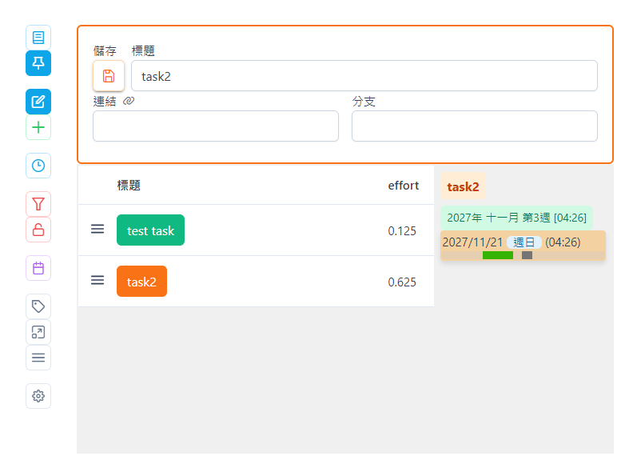
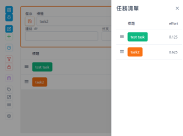
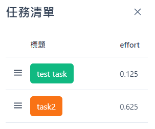
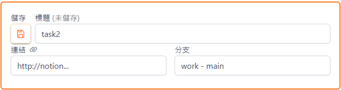
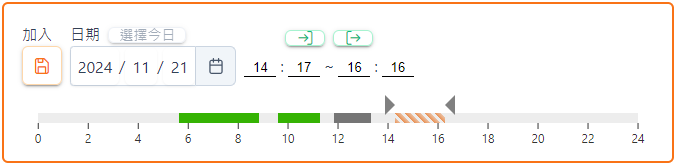
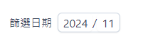
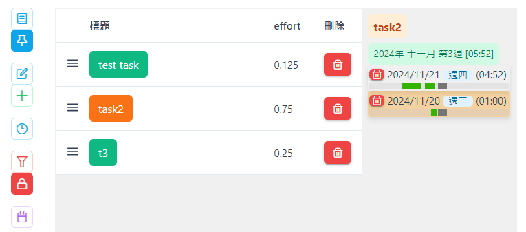
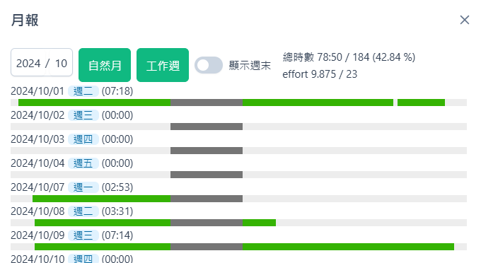
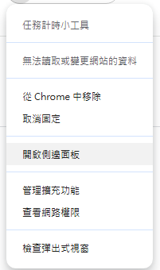
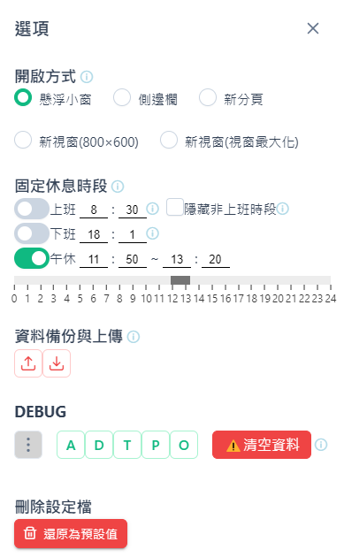

## ver. 1.5.3
### 畫面預覽

### 側邊欄 UI 說明
1. 顯示浮動任務清單

2. 固定顯示任務清單
3. 任務編輯器區塊
4. 新增任務
5. 時段編輯器區塊
6. 篩選時段
7. 顯示刪除按鈕
8. 月報
9. 在新分頁開啟小工具
10. 在新瀏覽器視窗開啟小工具
11. 在瀏覽器側邊欄開啟/關閉小工具
12. 選項
### 任務清單
點選任務標題以編輯該任務, 選定的任務顯示為橘色

### 任務編輯器
編輯模式為橘色外框 / 新增模式為綠色外框
可編輯任務資訊, 連結右側的迴紋針開啟下方網址
按下儲存按鈕以儲存資訊, 未儲存的內容將會遺失
按下ctrl+s可以儲存資訊

### 時段編輯器
日期: 選擇要登記的日期, 滑鼠滾輪或鍵盤上下鍵可增減年月日
時段: 選擇要登記的工作時段, 滑鼠滾輪或鍵盤上下鍵可增減時間
綠色時段: 點兩下, 可編輯該時段

### 篩選時段
任務清單與時段資料只顯示篩選年月

### 顯示刪除按鈕
平時隱藏刪除按鈕

### 月報
統計該月工作時段的覆蓋率
選擇年月後點選按鈕
自然月: 統計1號到該月最後一天
工作週: 統計該月工作週第一週到最後一週, 以週一為一週起始
該週如果跨越, 以天數過半(大於4天)判斷歸屬月份

### 開啟方式
如果出現樣式異常 試著關掉重開
或者嘗試右鍵以側邊欄開啟 :P

### 選項

開啟方式: 下次點選擴充功能圖示的動作
休息時段: 顯示為灰色, 此區間不會被登記為工作時間