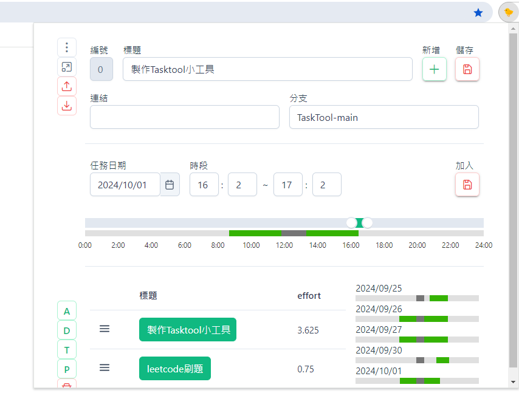

## ver 1.1 new feat
1. 可隱藏任務編輯區塊、時間編輯區塊
2. 刪除鎖、刪除任務、刪除日期資料

# TaskTool 工作日誌小工具 ver 1.0
## 簡介
記錄工時的小工具 ~~肝度記錄表~~

使用vue製作的擴充功能
資料儲存於瀏覽器儲存空間
## 截圖

## 使用方法
### 按鈕功能列 (左側)
1. 展開其他選項(目前沒有功能)
2. 開啟小工具於新分頁
3. 上傳資料
    指定.json檔，將覆蓋現在當前所有資料
4. 下載資料
    將瀏覽器資料匯出為.json檔
5. 其他DEBUG用按鈕
6. 刪除所有儲存資料

### 任務資訊區塊 (上)
1. 新增: ID編號+1，清除當前填寫資訊
2. 儲存: 儲存此ID資訊，不會儲存時間

### 時間輸入區塊 (中)
1. 任務日期: 選擇要填寫的任務日期
    如果當天有存檔資訊，時間軸會以綠色顯示工作時段
2. 時段與拖曳工具: 輸入時間用
    目前最少必須輸入一個小時，結束點自動帶入開啟小工具的時間
3. ~~肝度~~工時統計條: 顯示此任務用了當天哪些時段
    1. 綠色為工作時段，灰色為休息時段
    2. 假如輸入時段跨越休息時段，休息時段仍會被扣除
    3. 休息時段為11:50-13:20 (寫死)
    4. 假如輸入時段重疊，重疊時段會合併
    5. 滑鼠移到有色區段會顯示時間
4. 加入: 插入拉條小工具設定的時間

### 記錄表格 (下)
1. 點選標題按鈕，載入該任務
    右側顯示該任務記錄
    上方資訊區塊可以編輯
2. 任務排序可以變動，不影響ID
3. 右側顯示該任務花了多少肝

### 已知問題
1. ~~沒有刪除功能~~
2. 某些動作後畫面沒有被渲染，要觸發該事件